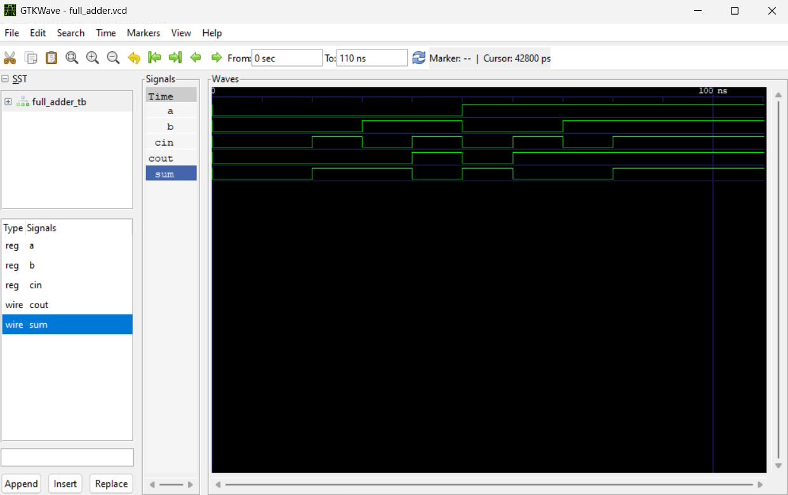

# Setting up a Verilog Simulation Environment on Windows with MSYS2

This guide details how to set up a free and open-source Verilog simulation environment on Windows using MSYS2, Icarus Verilog, and GTKWave. We will specifically use the **UCRT64** environment within MSYS2, which leverages the modern Windows Universal C Runtime.

Finally, we demonstrate the setup using a simple Full Adder example project.

## Part 1: Environment Installation and Setup

Follow these steps to install the necessary tools.

### Step 1: Install MSYS2

*   **Download:** Get the MSYS2 installer from the official website: [https://www.msys2.org/](https://www.msys2.org/)
*   **Install:** Run the installer and follow the on-screen instructions. A standard installation location (like `C:\msys64`) is recommended.

### Step 2: Launch the UCRT64 Shell

MSYS2 provides different environments. For compatibility with modern C libraries and tools, we will use the **UCRT64** environment.

*   Go to your Windows Start Menu.
*   Find the MSYS2 folder created during installation.
*   Click on the shortcut named **MSYS2 UCRT64**.
*   This will open a terminal window (similar to Linux bash). **Perform all subsequent steps within this UCRT64 shell.** The prompt often indicates the environment (e.g., `USERNAME@HOSTNAME UCRT64 ...`).

### Step 3: Update MSYS2 System Packages

It's crucial to have an up-to-date MSYS2 system before installing new packages.

*   Run the following command in the UCRT64 shell:
    ```bash
    pacman -Syu
    ```
*   You may be prompted to close the terminal after certain core packages update. If it says `Terminate batch job (Y/N)?`, type `y` and press Enter.
*   **Important:** After closing, **re-launch the MSYS2 UCRT64 shell** and run `pacman -Syu` **again** to ensure all updates are completed. Repeat this close-and-update cycle if prompted.

### Step 4: Install Icarus Verilog and GTKWave

Now, install the Verilog simulator (`iverilog`) and the waveform viewer (`gtkwave`) specifically built for the UCRT64 environment.

*   Run the following command in the UCRT64 shell:
    ```bash
    pacman -S mingw-w64-ucrt-x86_64-iverilog mingw-w64-ucrt-x86_64-gtkwave
    ```
*   Press `y` when prompted to confirm the installation.

### Step 5: Verify Installation (Optional but Recommended)

Check that the tools were installed correctly and are accessible from the UCRT64 shell:

*   Check for Icarus Verilog:
    ```bash
    which iverilog
    # Expected output: /ucrt64/bin/iverilog (or similar path within ucrt64)
    ```
*   Check for GTKWave:
    ```bash
    which gtkwave
    # Expected output: /ucrt64/bin/gtkwave (or similar path within ucrt64)
    ```
*   Check versions (optional):
    ```bash
    iverilog -V
    gtkwave --version
    ```

If these commands execute without "command not found" errors, your simulation environment is ready!

## Part 2: Example Project - Verilog Full Adder

This simple project demonstrates how to use the installed tools. It consists of a Full Adder design and a testbench to verify its functionality.

### Project Files

Make sure you have the following two files in your working directory:

1.  **`full_adder.v`**: Contains the Verilog module definition for the Full Adder logic.
    ```verilog
    //-----------------------------------------------------
    // Module: full_adder
    // Description: A simple Full Adder using dataflow modeling.
    //-----------------------------------------------------
    module full_adder (
        input  wire a, input  wire b, input  wire cin,
        output wire sum, output wire cout
    );
        assign sum = a ^ b ^ cin;
        assign cout = (a & b) | (a & cin) | (b & cin);
    endmodule
    ```

2.  **`full_adder_tb.v`**: Contains the Verilog testbench module.
    ```verilog
    //-----------------------------------------------------
    // Module: full_adder_tb
    // Description: Testbench for the full_adder module.
    //-----------------------------------------------------
    `timescale 1ns / 1ps
    module full_adder_tb;
        logic a, b, cin; // Inputs to drive the DUT
        wire sum, cout; // Outputs received from the DUT

        // Instantiate the Device Under Test (DUT)
        full_adder dut (.a(a), .b(b), .cin(cin), .sum(sum), .cout(cout));

        // Test sequence
        initial begin
            $dumpfile("full_adder.vcd"); // Waveform file
            $dumpvars(0, full_adder_tb); // Dump signals

            $display("Starting Full Adder Testbench...");
            $display("Time(ns)| a | b |cin|| sum |cout |");
            $display("--------|---|---|---||-----|-----|");
            for (integer i = 0; i < 8; i = i + 1) begin
                {a, b, cin} = i;
                #10; // Wait 10 ns
                $display("   %0t   | %b | %b | %b ||  %b  |  %b  |", $time, a, b, cin, sum, cout);
            end
            #20;
            $display("Testbench finished.");
            $finish;
        end
    endmodule
    ```

### Compiling and Running the Simulation

1.  **Navigate:** In your **MSYS2 UCRT64 shell**, use the `cd` command to navigate to the directory where you saved `full_adder.v` and `full_adder_tb.v`.
    ```bash
    # Example: cd /e/verilog/fulladder
    cd path/to/your/project/folder
    ```
2.  **Compile:** Use `iverilog` to compile *both* files into a simulation executable named `full_adder_sim`.
    ```bash
    iverilog -o full_adder_sim full_adder.v full_adder_tb.v
    ```
3.  **Run:** Execute the simulation using `vvp`.
    ```bash
    vvp full_adder_sim
    ```
    *   **Expected Output:** You will see the console output generated by the `$display` statements in the testbench, showing the sum and carry-out for each input combination over time.

### Viewing Waveforms

1.  **Check for VCD file:** The simulation run (`vvp`) should have created a file named `full_adder.vcd` in your project directory (due to the `$dumpfile` command in the testbench).
2.  **Launch GTKWave:** Start the waveform viewer with the VCD file.
    ```bash
    gtkwave full_adder.vcd
    ```
3.  **View Signals:** Inside GTKWave:
    *   Navigate the signal hierarchy in the top-left "SST" panel (e.g., expand `full_adder_tb`).
    *   Select the signals (`a`, `b`, `cin`, `sum`, `cout`).
    *   Click the "Append" button.
    *   The waveforms will appear in the main panel. Use the zoom buttons (like magnifying glass with arrows) to view the simulation timeline.

This completes the setup and basic usage demonstration of Icarus Verilog and GTKWave within the MSYS2 UCRT64 environment on Windows.
### Wave Form Example
